# BlinkToText - Python Desktop for sending Eye Blinks via SMS

## BlinkToText is an open source, free, and easy to use software program that converts eye blinks to text. Demo: https://youtu.be/2b78errgVOU.

### Introduction
Paralyzed people lack the ability to control muscle function in one or more muscle groups. The condition can be caused by stroke, ALS, multiple sclerosis, and many other diseases. Locked-in Syndrome (LIS) is a form of paralysis where patients have lost control of nearly all voluntary muscles. These people are unable to control any part of their body, besides eye movement and blinking. Due to their condition, these people are unable to talk, text, and communicate in general. Even though people that have LIS are cognitively aware, their thoughts and ideas are locked inside of them. These people depend on eye blinks to communicate. They rely on nurses and caretakers to interpret and decode their blinking. Whenever LIS patients do not have a person to read their eye blinks available, they have no means of self expression.  

BlinkToText offers a form of independence to paralyzed people. The software platform converts eye blinks to text. Every feature of the software can be controlled by eye movement. Thus, the software can be independently operated by paralyzed people. Using the software, patients can record messages, recite those messages aloud, and send the messages to others. The software can be run on any low end computer, from a Raspberry Pi to an IBM Thinkpad. The software uses computer vision and Haar cascades to detect eye blinking and convert the motion into text. The program uses language modelling to predict the next words that the user might blink. The software can be easily customized for each patient as well. BlinkToText is free open source software. It is distributed under the MIT Permissive Free Software License.

### Key Objectives

#### Allow paralysis victims to communicate independently.

Many paralysis victims already use eye blinks as a form of communication. It is common for nurses and caretakers to read a patient’s eye blinks and decode the pattern. The ALS association even offers a communication guide that relies on eye blinks. BlinkToText automates this task. The software reads a person’s eye blinks and converts them into text. A key feature of the software is that it can be started, paused, and operated entirely with eye blinks. This allows patients to record their thoughts with complete independence. No nurses or caretakers are required to help patients express themselves. Not only does this reduce the financial burden on paralysis patients, but this form of independence can be morally uplifting as well.

#### Be accessible to people with financial constraints.

Many companies are developing technologies that are controlled by eye movement. These technologies rely on expensive hardware to track a user`s eyes. While these devices can absolutely help LIS victims, they are only available to people that can afford the technology. BlinkToText focuses on a different demographic that are often ignored. Twenty-eight percent of U.S. households with a person who is paralyzed make less than $15,000 per year[1]. BlinkToText is free and open source. The software runs on wide variety of low end computers. The only required peripheral is a basic webcam. Not only is this software accessible to paralyzed people, but paralyzed people of almost all financial classes as well.

#### Open Source and Licensing
Blink to Text is free open source software. It is distributed under the MIT Permissive Free Software License. All of the code is available on Github. A majority of the software is written in Python. Specifically, the image processing is done with Python’s OpenCV library and the GUI was made with PyQT. Python is an open source programming language. This means that all .exe and other distributables of the software can be decompiled. All of the Haar Cascades were obtained from OpenCV’s repository of free and open source Haar Cascades. 

### Platform Features
BlinkToText offers a range a tools to help paralyzed people communicate. Below is an explanation of the platform’s main features.

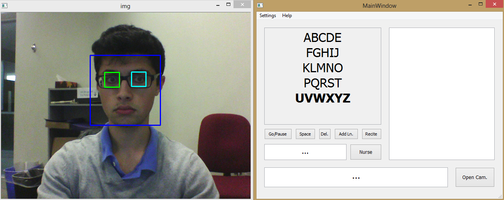

[Figure 1: BlinkToText GUI]

#### Selecting with Blinks

The software cycles through seven rows continuously. Users select a row by blinking. The software then cycles through each element in the selected row. The user can blink to select the highlighted element. If the user selects a character, the program appends the character to the Bottom Dialog Box. If the user selects a button, the program executes the button function. This system allows users to blink text in an intuitive way. Other attempts at BlinkToText software forced users to use Morse Code and other confusing systems to communicate.[10]

[Figure 2: Selecting Character]

#### Camera Window

The software analyses a webcam feed while functioning. Users can view the webcam feed by selecting the Open Cam Button.

#### Customization

The software is built around blink detection because almost all people with severe paralysis retain that ability. If a paralyzed person can conduct other body movements as well, the software should take advantage of that. With the customization feature, users can set certain actions as hot keys. If the program detects a certain body movement, it will automatically do the preset function. Currently, the software can detect three additional actions besides blinking.

* Left Eye Wink
* Right Eye Wink
* Finger Movement

Users can use these body movements to trigger any of the button functions. Additionally, users can use any of these body actions instead of blinking, with the Same as Blink Option.

Everyone’s disability is different. Ideally, every disabled person would have a custom made solution for their problems. Unfortunately, this option is outside of the financial constraints of many families. BlinkToText offers a partially customizable system that works for most people.

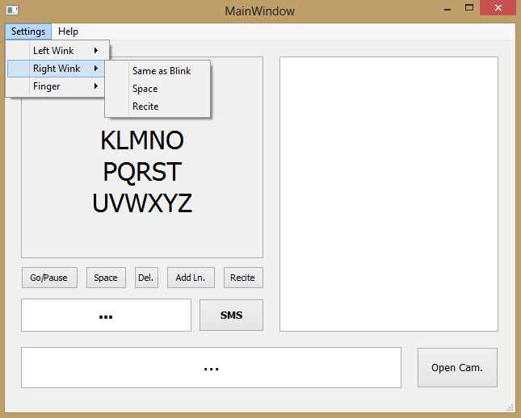

[Figure 3: Customizing BlinkToText]

#### Right Dialog Box

The message that a person is currently blinking is viewable in the Bottom Dialog Box. Users can store previous messages in the Right Dialog Box with the Add Ln. Button.

[Figure 4a: Adding Line to Dialog]

#### Recite button

The program can recite text that the user records. When the user selects the Recite Button, the program recites all text in the Right and Bottom Browser Box. The program recites the notes in a female voice. The default voice can be changed. Most people find female synthesized voices warmer and more friendly than male synthesized voices[8]. Therefore, a female voice is BlinkToText’s default voice.

#### Predict Next Word

The software automatically predicts the next word that the user will blink. To save time, the user can automatically select this word.

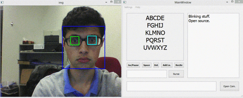

[Figure 4b: BlinkToText Predicting Next Word]

#### SMS button

Patients can send their blinked out messages as an SMS with the SMS button.

#### Go/Pause button

The Go/Pause Button lets users start and stop the program at will.

### Eye Blink Detection Algorithms

There are multiple ways to detect eyes in a video. This is a relatively new problem, so the standard technique has not been established. Different methods were researched, all of which have their own pros and cons. Below is a brief synopsis of each technique below. BlinkToText primarily uses the fourth mentioned technique.

#### Detecting Eye Blinks with Facial Landmarks

Eye blinks can be detected by referencing significant facial landmarks. Many software libraries can plot significant facial features within a given region of interest. Python’s dlib library uses Kazemi and Sullivan’s One Millisecond Face Alignment with an Ensemble of Regression Trees[5] to implement this feature.

The program uses a facial training set to understand where certain points exist on facial structures. if they exists, the program plots the same points on regions of interest in other images. The program uses priors to estimate the probable distance between key points [5].

The library outputs a 68 point plot on a given input image.

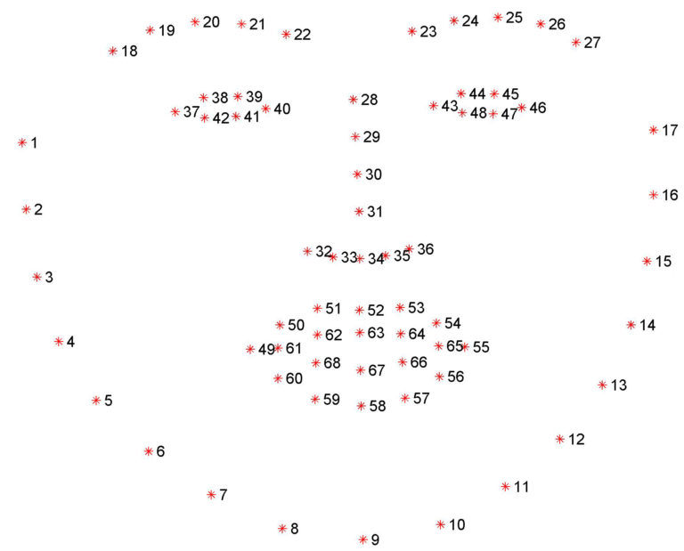

[3, Figure 5: Dlib Facial Landmark Plot]

For eye blinks we need to pay attention to points 37-46, the points that describe the eyes.

In Real Time Eye Blinking Using Facial Landmarks[4], Soukupová and Čech derive an equation that represents the Eye Aspect Ratio. The Eye Aspect Ratio is an estimate of the eye opening state.

Based on Figure 6, the eye aspect ratio can be defined by the below equation.

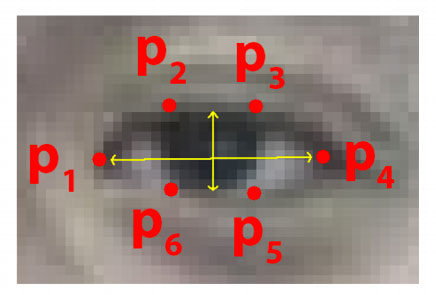

[4, Figure 6: Eye Facial Landmarks]

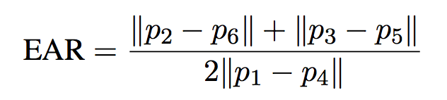

[4, Figure 7: Eye Aspect Ratio Equation]

“The Eye Aspect Ratio is a constant value when the eye is open, but rapidly falls to 0 when the eye is closed.” [3] Figure 8 show a person’s Eye Aspect Ratio over time. The person’s eye blinks are obvious.

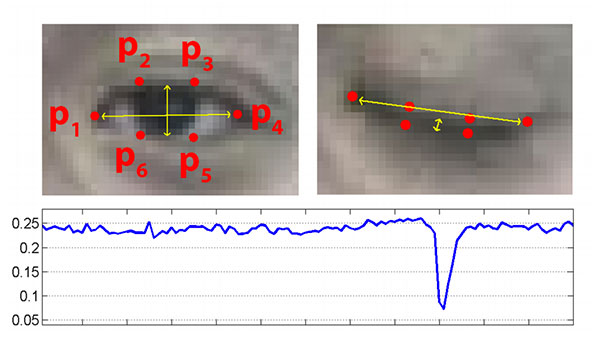

[4, Figure 8: Eye Aspect Ratio vs Time]

A program can determine if a person’s eyes are closed if the Eye Aspect Ratio falls below a certain threshold.

#### Detecting Eye Blinks with Frame Differencing

Frame differencing is another blink detection technique. Essentially, a program compares subsequent video frames to determine if there was any movement in a select eye region.

In most programs, the first step is to detect any faces in a video feed using a face detector, such as the Viola-Jones Face Detector. The face detector returns a bounding box of an area that contains a face, as seen in Figure 9.

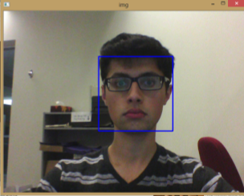

[Figure 9: Face Detector Placing Bounding Box Over Face]

The program then analyses this region of interest for eyes using similar detection tools. The program places a bounding box on any regions of interest.

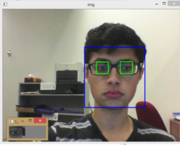

[Figure 10: Eye Detector Placing Bounding Boxes Over Eyes]

The program then compares the difference between eye region of interests in subsequent frames.[5] Any different pixels are plotter on a separate image. Figure 11 demonstrates a program using frame differencing to detect hand movement. A Binary Threshold and Gaussian Blur filter the images.

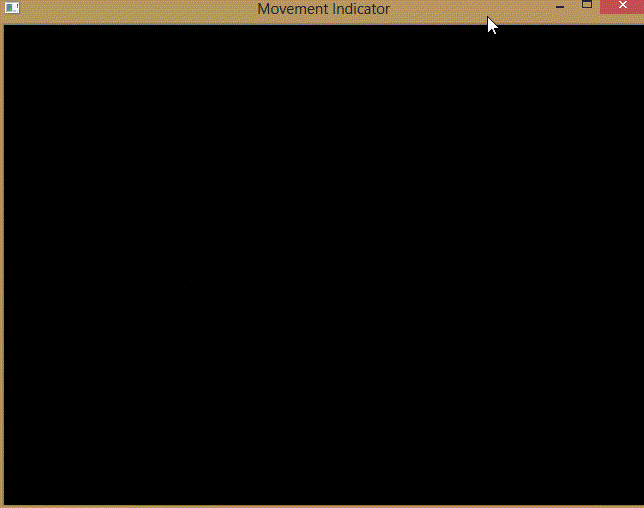

[Figure 11: Frame Differencing Program Detecting Hand Movement]

Algorithm Used in Project: Detecting Eye Blinks with Pupil Detection
Using pupils to detect eye blinks has a similar process to frame differencing. Once again, the program starts off by placing a bounding box on any detected faces within a region of interest. The program then detects general eye regions within the face bounding box.

The program will search the eye region of interest for pupils. Before, analyzing the region, the program will ensure that their is a high contrast between objects in the image. Therefore, the program converts the region to gray-scale and runs a Guassian blur. The image filtering is conducted only on this region instead of the whole image for efficiency purposes. The program runs a Circle Hough transform on the area. If the software can detect a circle roughly in the center of the region and that circle takes up roughly the correct amount of area,  the software assumes that the circle is the pupil. If the pupil is detected, then the software can assume that the eye is open[6].

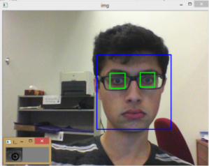

[Figure 12: Circle Hough Transform Detecting Pupil]

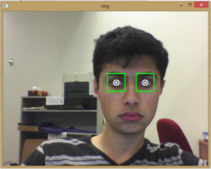

[Figure 13: Circle Hough Transform Detecting Pupil on User With No Glasses]

Generally, humans blink 11-19 times per minute[9]. It is important that BlinkToText can differentiate between intentional and unintentional blinks. Therefore, the software does not recognize a blink unless it lasts longer 1.25 seconds. This ensures that any involuntary blinks do not affect the software.

The software uses Haar Cascades to determine whether a region contains a face and/or eye. The image processing is accomplished with the OpenCV library. The GUI is made with PyQT.

### Applications in Society

It is obvious that an eye blink based communication tool would benefit many people. But the best technique to employ this technology is still up for debate. BlinkToText is a software based solution that can run on low end computers. I envision computers with BlinkToText software mounted on wheelchairs and bedsides. The computer's camera would constantly be monitoring the intended LIS patient. Whenever a patient wants to communicate, they would double blink to start the software, and blink out the rest of their thoughts as they wish.

### Procedure

#### Words Per Minute

The average number of words that can be blinked per minute was calculated.

1. A laptop was positioned 60 cm from the user's face.
2. BlinkToText software was started.
3. 5 minute timer was started. As many words in first paragraph were blinked. Number of blinked words were recorded.
4. Steps 1-4 were repeated for the other four paragraphs.
5. Number of blinked words in each test were plotted on a scatter-plot. Average Words Per Minute (WPM) value was calculated.
(BlinkToText uses natural language processing for word prediction and user efficiency. Therefore it was important to use coherent text while testing for WPM.)

#### Distance Vs. Blink Detection

The relationship between distance and the accuracy of the blink detector was calculated.

1. A laptop was positioned 30 cm from the user's face.
2. BlinkToText BlinkDetector module was started.
3. 20 blinks were made by the user. There was a 5 second gap between each blink. Each blink was approximately 2 seconds long. The number of blinks detected by the software were recorded.
4. Step 3 was repeated 5 times with distances of 60 cm, 90 cm, 120 cm, 150 cm, and 180 cm.
5. The BlinkDetector accuracy was plotted on a bar graph.

### Hardware

BlinkToText was primarily developed and tested on a 64-bit Windows 8 Dell Inspiron Laptop. The laptop has an Intel Core i5-4200U CPU @ 1.60GHz 2.30 GHz and 4.00 GB RAM. The program uses the laptop's integrated webcam for video capture.

The program was successfully tested on an IBM Thinkpad and Raspberry Pi Model B as well. All of the observations were made while using the Dell Inspiron Laptop.

### Analysis

With BlinkToText, users can express an average of 1.96 words per minute. As seen in Figure 14, the mean deviation is quite small. Even though BlinkToText's average WPM is much lower than most people can speak, it is close to other accessibility systems. Stephen Hawking current text-to-speech system allows him to speak at 1 WPM. However, it is important to consider that Stephen Hawking's daily vocabulary is much more complex than the lexicon used to test BlinkToText. Either way, BlinkToText provides a working, albeit slow, means of communication for LIS patients. Increasing BlinkToText's WPM is a key focus for future development.

The distance between the user and webcam affects the reliability of the software. BlinkToText is highly consistent while the distance is less than 60 cm. As the distance increases, the blink detection algorithm fails more often. If the BlinkToText software is embedded on a wheel chair system, it falls under the 60 cm threshold. Therefore LIS patients can use the software reliably while in a wheelchair. 

### Conclusions

BlinkToText provides a viable option for LIS patients to communicate. The software's accessibility first design allow's LIS patients to express themselves independently. The software being opensource and requiring no high end hardware ensures that it is widely availible across financial classes.

Of course, their is still room for improvement in future iterations of the software. In short term development, the blink detection algorithm should be made more robust. After doing more research, it seems that the Facial Landmarks technique may be more accurate than the Hough Transform technique. The software should migrate to this system. In long term development, more activities should be made within the reach of an eye blink. If a person cannot transverse physical space, she/he should still be able to explore cyberspace. Personally, I find the idea of a web browser controlled completely by eye movement intriguing, imperative, and the next logical step for this project.

### References 

[1]Christopher and Dana Reeve Foundation. (2013. Prevalence of Paralysis in the United States. Short Hills, NJ. [Electronic]. Available: https://www.christopherreeve.org/living-with-paralysis/stats-about-paralysis

[2]Rick Hansen Institute. (2013. Canadians Unaware of Staggering Costs of Spinal Cord Injury and Paralysis. Vancouver, Canada. [Electronic]. Available: http://www.rickhanseninstitute.org/resource/publications-media/news/313-canadians-unaware-of-staggering-costs-of-spinal-cord-injury-and-paralysis

[3] A Rosebrock. (2017, Apr. 3). Facial landmarks with dlib, OpenCV, and Python [Online]. Available: https://www.pyimagesearch.com/2017/04/03/facial-landmarks-dlib-opencv-python/

[4] T. Soukupova and J. Cech. (2016, Feb. 3) Real-Time Eye Blink Detection using Facial Landmarks. Center for Machine Perception, Department of Cybernetics Faculty of Electrical Engineering, Czech Technical University in Prague. Prague, Czech Republic. [Electronic]. Availible: https://vision.fe.uni-lj.si/cvww2016/proceedings/papers/05.pdf

[5] V. Kazemi and J. Sullivan. (2014) One Millisecond Face Alignment with an Ensemble of Regression Trees. Royal Institute of Technology Computer Vision and Active Perception Lab. Stockholm, Sweden. [Electronic]. Availible: https://pdfs.semanticscholar.org/d78b/6a5b0dcaa81b1faea5fb0000045a62513567.pdf

[6] K. Toennies, F. Behrens, M. Aurnhammer. (2002, Dec. 10). Feasibility of Hough-Transform-based Iris Localisation for Real-Time-Application. Dept. of Computer Science, Otto-von-Guericke Universität. Magdeburg, Germany. [Electronic]. Available: http://citeseerx.ist.psu.edu/viewdoc/download?doi=10.1.1.69.3667&rep=rep1&type=pdf

[7] B. Raghavan. (2015). Real Time Blink Detection For Burst Capture. Stanford University. Standford, CA. [Electronic]. Available: https://web.stanford.edu/class/cs231m/projects/final-report-raghavan.pdf

[8] W. Mitchell, C. Ho, H. Patel, K. MacDorman. (2010). Does social desirability bias favor humans? Explicit-implicit evaluations of synthesized speech support a new HCI model of impression management. School of Informatics, Indiana University. Indianapolis, IN. [Electronic]. Available: http://macdorman.com/kfm/writings/pubs/Mitchell2010DoesSocialDesirabilityBiasFavorHumans.pdf

[9] C. Sforza, M. Rango, D. Galante, N. Bresolin, V. Ferrario. (2008). Spontaneous blinking in healthy persons: an optoelectronic study of eyelid motion. Functional Anatomy Research Center, Università degli Studi. Milano, Italy. [Electronic]. Available: https://www.ncbi.nlm.nih.gov/pubmed/18565090

[10] C. Pinheiro, E. Naves, P. Pino, E. Losson, A. Andrade, G. Bourhis. (2011). "Alternative communication systems for people with sever motor disabilities", BioMedical Engineering OnLine. 10:31. April 2011. [Electronic]. Available: https://biomedical-engineering-online.biomedcentral.com/articles/10.1186/1475-925X-10-31
